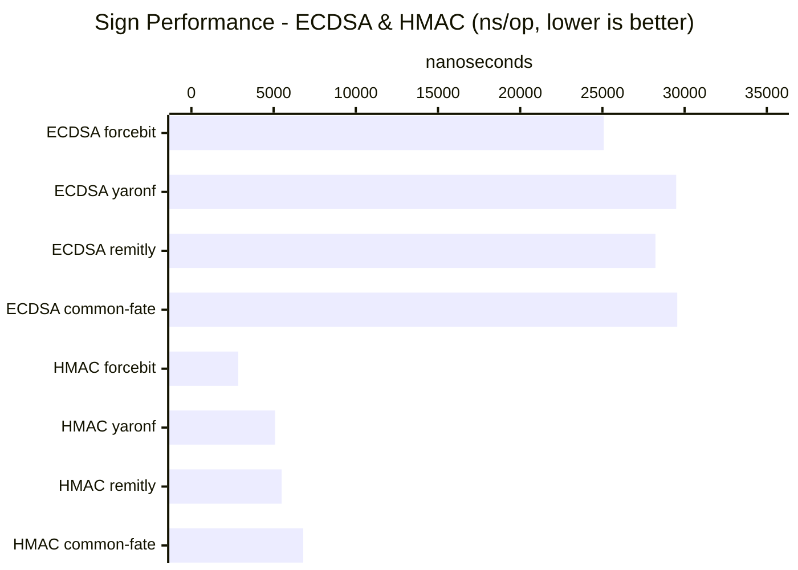
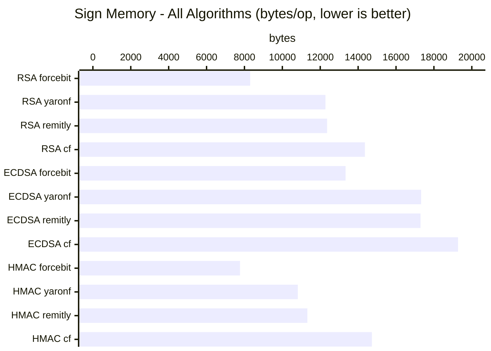
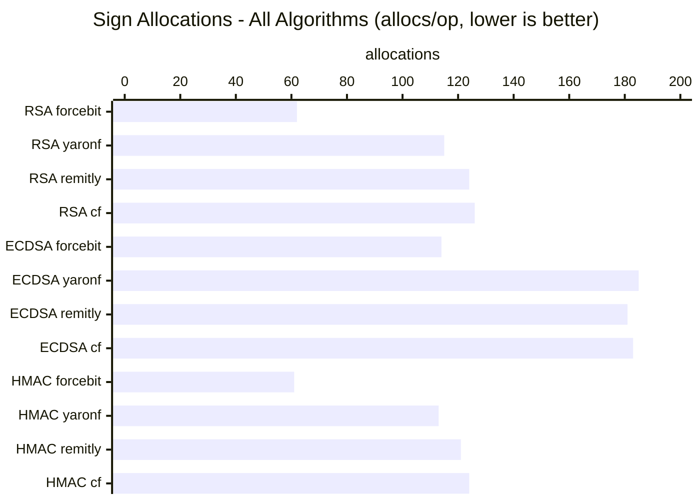
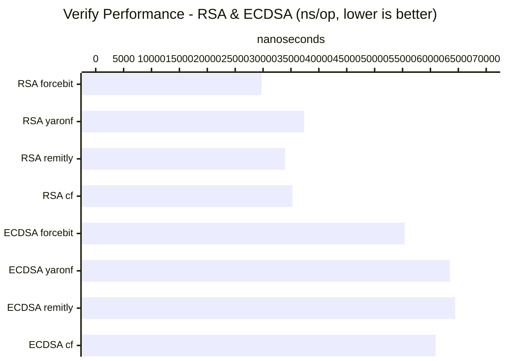
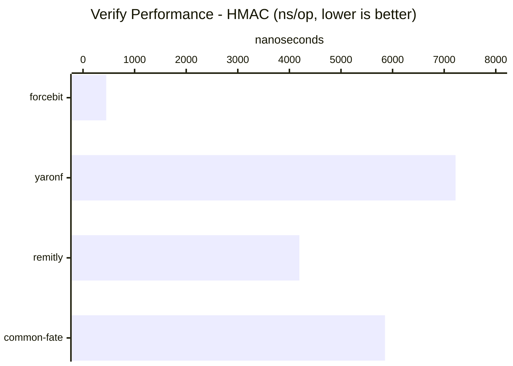
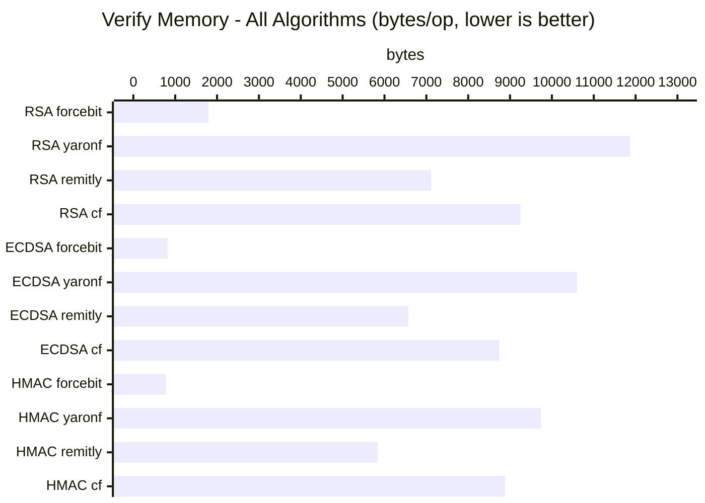
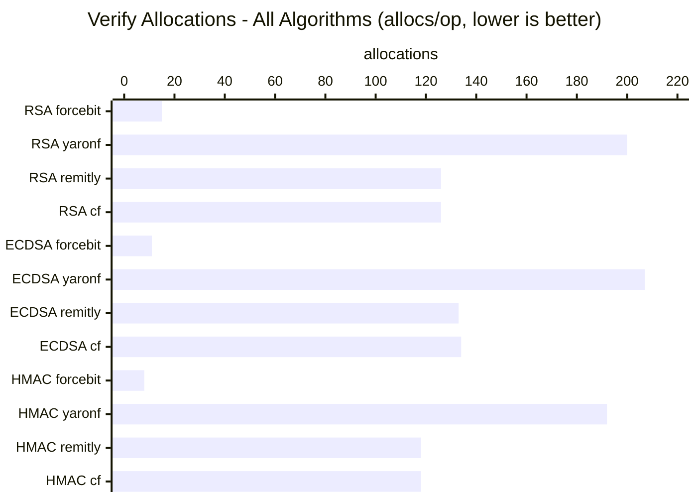

# HTTP Message Signatures Library Benchmarks

Benchmark comparison of Go implementations of RFC 9421 HTTP Message Signatures.

## Libraries Compared

| Library                | Import Path | Description |
|------------------------|-------------|-------------|
| **forcebit**           | `github.com/forcebit/http-message-signatures-rfc9421-go` | Zero-dependency RFC 9421 implementation |
| yaronf/httpsign        | `github.com/yaronf/httpsign` | Feature-complete RFC 9421 implementation |
| remitly-oss/httpsig-go | `github.com/remitly-oss/httpsig-go` | Production-ready RFC 9421 implementation |
| common-fate/httpsig    | `github.com/common-fate/httpsig` | RFC 9421 with middleware focus |

## Benchmark Environment

- **Go Version**: 1.24
- **OS**: macOS (Darwin)
- **Architecture**: arm64 (Apple Silicon)
- **CPU**: Apple M2

## Algorithms Tested

- **RSA-PSS-SHA512**: 2048-bit RSA key with PSS padding
- **ECDSA-P256-SHA256**: P-256 elliptic curve
- **HMAC-SHA256**: 64-byte symmetric key

## Results

### Sign Performance (ns/op, lower is better)

| Algorithm | forcebit   | yaronf | remitly | common-fate |
|-----------|------------|--------|---------|-------------|
| RSA-PSS-SHA512 | 1,012,858  | 965,976 | 978,961 | 952,112 |
| ECDSA-P256-SHA256 | **25,082** | 29,489 | 28,230 | 29,553 |
| HMAC-SHA256 | **2,853**  | 5,088 | 5,491 | 6,799 |



### Sign Memory Allocations (B/op)

| Algorithm | forcebit   | yaronf | remitly | common-fate |
|-----------|------------|--------|---------|-------------|
| RSA-PSS-SHA512 | **8,301**  | 12,275 | 12,363 | 14,358 |
| ECDSA-P256-SHA256 | **13,338** | 17,325 | 17,293 | 19,271 |
| HMAC-SHA256 | **7,766**  | 10,817 | 11,321 | 14,725 |



### Sign Allocation Count (allocs/op)

| Algorithm | forcebit | yaronf | remitly | common-fate |
|-----------|----------|--------|---------|-------------|
| RSA-PSS-SHA512 | **62**   | 115 | 124 | 126 |
| ECDSA-P256-SHA256 | **114**  | 185 | 181 | 183 |
| HMAC-SHA256 | **61**   | 113 | 121 | 124 |



### Verify Performance (ns/op, lower is better)

| Algorithm | forcebit   | yaronf | remitly | common-fate |
|-----------|------------|--------|---------|-------------|
| RSA-PSS-SHA512 | **29,730** | 37,363 | 33,930 | 35,244 |
| ECDSA-P256-SHA256 | **55,380** | 63,504 | 64,433 | 60,928 |
| HMAC-SHA256 | **450**    | 7,221 | 4,194 | 5,853 |





### Verify Memory Allocations (B/op)

| Algorithm | forcebit  | yaronf | remitly | common-fate |
|-----------|-----------|--------|---------|-------------|
| RSA-PSS-SHA512 | **1,792** | 11,869 | 7,115 | 9,248 |
| ECDSA-P256-SHA256 | **816**   | 10,604 | 6,570 | 8,744 |
| HMAC-SHA256 | **776**   | 9,740 | 5,834 | 8,888 |



### Verify Allocation Count (allocs/op)

| Algorithm | forcebit | yaronf | remitly | common-fate |
|-----------|----------|--------|---------|-------------|
| RSA-PSS-SHA512 | **15**   | 200 | 126 | 126 |
| ECDSA-P256-SHA256 | **11**   | 207 | 133 | 134 |
| HMAC-SHA256 | **8**    | 192 | 118 | 118 |



## Key Observations

### Signing Performance
1. **RSA-PSS-SHA512**: All libraries perform similarly (~1ms), as cryptographic operations dominate
2. **ECDSA-P256-SHA256**: forcebit is **15-18% faster** than alternatives
3. **HMAC-SHA256**: forcebit is **1.8-2.4x faster** than alternatives

### Verification Performance
1. **RSA-PSS-SHA512**: forcebit is **12-26% faster** than alternatives
2. **ECDSA-P256-SHA256**: forcebit is **10-16% faster** than alternatives
3. **HMAC-SHA256**: forcebit is **9-16x faster** than alternatives

### Memory Efficiency
- Forcebit consistently uses **40-85% less memory** than alternatives
- Forcebit makes **50-90% fewer allocations** than alternatives
- Lower allocation count translates to reduced GC pressure

## Running Benchmarks

```bash
cd benchmarks/comparison

# Run all benchmarks
go test -bench=. -benchmem -count=5

# Run specific algorithm
go test -bench="RSAPSS" -benchmem -count=3

# Run only sign benchmarks
go test -bench="BenchmarkSign" -benchmem -count=3

# Run only verify benchmarks
go test -bench="BenchmarkVerify" -benchmem -count=3

# Save results to file
go test -bench=. -benchmem -count=5 | tee results.txt
```

## Benchmark Methodology

1. **Fair Comparison**: All libraries sign the same HTTP request with equivalent components
2. **Components Signed**: `@method`, `@authority`/`@target-uri`, `@path`, `content-type`
3. **Key Generation**: Keys are generated once at init and reused for all benchmarks
4. **Pre-signing for Verify**: Signatures are pre-generated before verify benchmarks to isolate verification time
5. **Memory Tracking**: `b.ReportAllocs()` used to track memory allocations

## Dependencies

Each library has different dependency requirements:

| Library                | External Dependencies |
|------------------------|----------------------|
| forcebit               | `golang.org/x/crypto` only |
| yaronf/httpsign        | Multiple (httpsfv, jwx, etc.) |
| remitly-oss/httpsig-go | Moderate |
| common-fate/httpsig    | Moderate |
